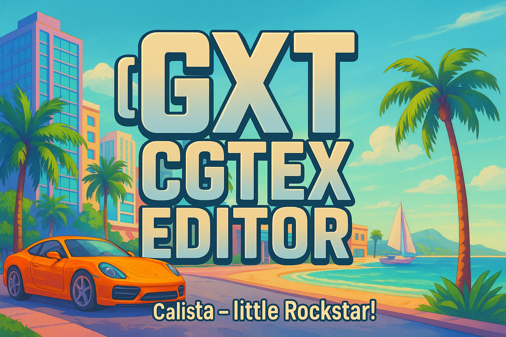
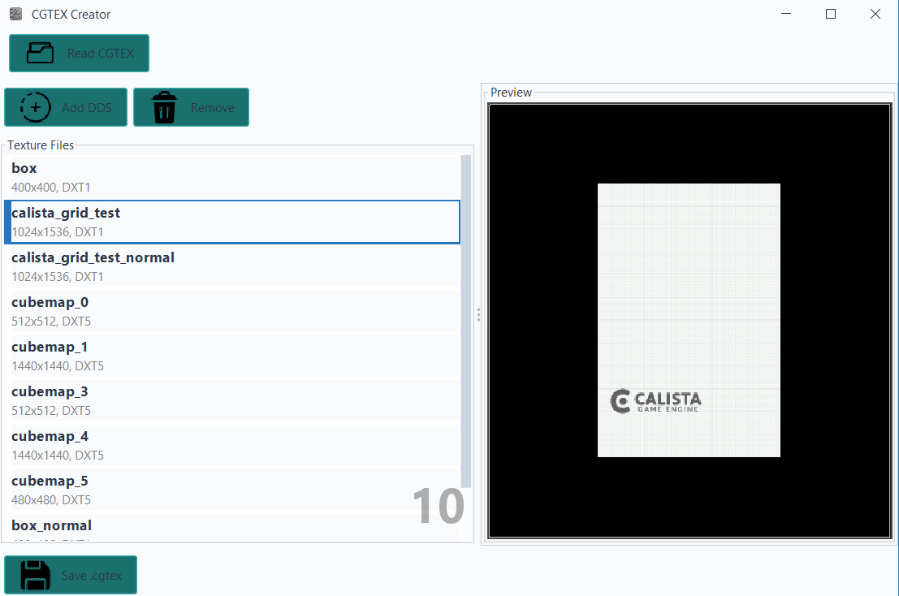

# CGTEX — Текстурный формат для Calista Game Engine

<p align="center">
  
</p>

<p align="left">
  <a href="https://img.shields.io/badge/Version-1.0.0-blue"></a>
  <a href="https://img.shields.io/badge/Built%20With-Java_17-orange"></a>
  <a href="https://img.shields.io/badge/UI-FlatLaf-brightgreen"></a>
  <a href="https://img.shields.io/badge/Engine-Calista_Game_Engine-red"></a>
</p>

---

## 🇷🇺 Описание

**CGTEX** — это собственный бинарный формат текстур, используемый в игровом движке **Calista Game Engine**. Он разработан для эффективного хранения, загрузки и обработки текстур в сценах.

### 🔧 Особенности:
- Поддержка различных форматов изображений (RGBA, RGB, Grayscale и др.)
- Встроенные метаданные (размер, имя, флаги)
- Быстрая десериализация в GPU-память
- Поддержка mip-уровней и флагов сжатия (в будущем)

### 📦 Структура файла (предварительная):
```
[Заголовок  (magic: CGTX)]
[Версия формата (1 byte)]
[Размеры: ширина, высота (int)]
[Формат пикселей (1 byte)]
[Имя текстуры (UTF-8 + длина)]
[Данные изображения (байты)]
```

### 🛠 Использование:
Файл можно создать и отредактировать с помощью **GTEX Editor**, графического инструмента, поставляемого с движком.
<p align="center">
  
</p>

### 📚 Зависимости:
- Java 17+
- FlatLaf UI Framework
- Поддержка CalistaGameEngine v1.0+

---

## 🇬🇧 CGTEX — Texture Format for Calista Game Engine

**CGTEX** is a custom binary texture format used in the **Calista Game Engine**. It is designed for efficient storage, loading, and manipulation of texture data in game scenes.

### 🔧 Features:
- Supports multiple image formats (RGBA, RGB, Grayscale, etc.)
- Embedded metadata (size, name, flags)
- Fast deserialization into GPU memory
- Future support for mipmaps and compression flags

### 📦 File Structure (draft):
```
[Header     (magic: CGTX)]
[Format version (1 byte)]
[Dimensions: width, height (int)]
[Pixel format (1 byte)]
[Texture name (UTF-8 + length)]
[Image data (bytes)]
```

### 🛠 Usage:
CGTEX files can be created and edited using the **GTEX Editor**, a GUI tool bundled with the engine.

### 📚 Dependencies:
- Java 17+
- FlatLaf UI Framework
- CalistaGameEngine v1.0+ support
